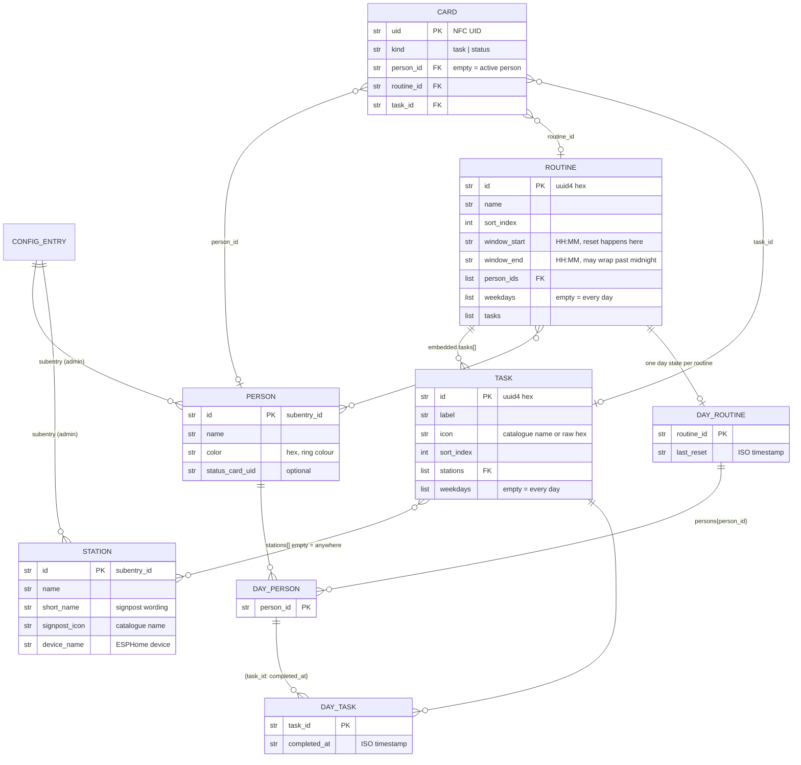

# Data model

Three layers. People and scan points are sub-entries of the single config entry, so Home Assistant
gives them devices and configuration dialogs and keeps them admin-only. Routines, tasks and cards
live in storage and are meant to be edited without admin rights. The day state is a separate store
that is cleared whenever a routine's time window opens.

## Where each object lives

| Layer | Location | Admin required |
| --- | --- | --- |
| Person, station | sub-entries of the single config entry | yes |
| Routine, task | `family_routines.routines` | no |
| Card | `family_routines.cards` | no |
| Day state | `family_routines.day` | no |

## What the diagram cannot show

A task is physically part of its routine. It has no store file of its own and no global namespace,
so a task id is only meaningful together with its routine id.

A card without a `person_id` belongs to whoever is active at the scan point, which is why that
relation is optional. This is what makes both a shared set of cards and one set per child work
without a second card kind.

The active person per scan point is runtime context held by the coordinator. It expires after a
timeout and is never written to storage, so a restart leaves every scan point waiting for the next
card.

Everyone assigned to a routine shares its task list and keeps their own progress. There is no
per-person copy of a task; the split happens only in the day state.
